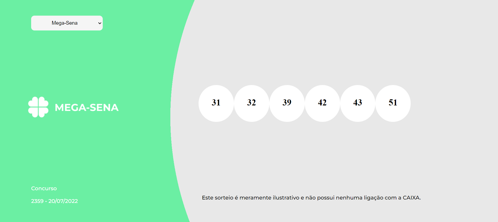
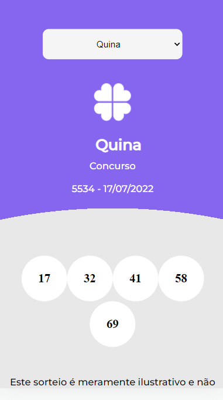

# Lotto Labenu

Esse sdite pode ser econtrado através do link [Lotto Labenu](lottolabenuchrisbotto.surge.sh).

## Objetivos

 - Aplicação React que possibilitaa visualização de concursos de loteria. O usuário pode escolher qual resultado ele quer ver a partir de um meno na esquerda superior.

## O que não funciona

 - Há um pequeno erro no menu de selecionar, que ao ser clicado a primeira vez, aparece uma opção e depois some. Mas o menu funciona corretamente.

  - Duas das loterias (loto mania e loto fácil) têm uma quantidade enorme de dezenas. Não consegui fazer com que a apresentação ficasse boa tanto no desktop como mobile, então priorizei movile.

## Imagens do projeto

